# Procurement Intelligence System 🤖

An AI-powered procurement intelligence platform that combines **LangGraph agent workflows** with real-time supplier discovery and market analysis.

## 🎯 **Core Features**

- **🤖 LangGraph Agent Workflow**: Structured 4-step AI procurement analysis
- **🔍 Real-time Supplier Discovery**: DuckDuckGo search with AI enhancement
- **📊 Market Intelligence**: AI-powered market trends and pricing analysis
- **⚡ Dual LLM Integration**: Groq and Gemini APIs with fallback support
- **💾 Smart Caching**: In-memory caching for improved performance
- **🌐 Professional UI**: Clean, responsive web interface
- **🚀 Zero-Config Deployment**: Ready for Render deployment

## 🏗️ **LangGraph Agent Workflow**

```mermaid
graph TD
    A[🔍 Search Suppliers] --> B[🤖 Analyze Suppliers]
    B --> C[📊 Generate Market Insights]
    C --> D[📝 Create Summary]
    
    A1[Multi-Query DuckDuckGo Search] --> A
    A2[Rate Limiting & Caching] --> A
    A3[Result Deduplication] --> A
    
    B1[Extract Company Info] --> B
    B2[LLM Enhancement] --> B
    B3[Confidence Scoring] --> B
    
    C1[Price Trend Analysis] --> C
    C2[Market Factor Identification] --> C
    C3[Procurement Recommendations] --> C
    
    D1[Executive Summary] --> D
    D2[Processing Metrics] --> D
    D3[Next Steps] --> D
    
    style A fill:#e1f5fe
    style B fill:#fff3e0
    style C fill:#f3e5f5
    style D fill:#e8f5e8
```



## 📁 **Simplified Architecture**

```
procure_project/
├── main.py                 # FastAPI app with embedded HTML
├── agent_graph.py          # LangGraph workflow definition
├── search_service.py       # DuckDuckGo search service
├── llm_service.py          # Groq + Gemini LLM service
├── requirements.txt        # Minimal dependencies
└── .env                    # API configuration
```

## 🚀 **Quick Start**

### **Prerequisites**
- Python 3.11+ (recommended)
- Groq API key
- Gemini API key

### **Installation**

```bash
# 1. Clone and navigate to project
git clone <repository-url>
cd procure_project

# 2. Create virtual environment with Python 3.11
python3.11 -m venv procurement_env
source procurement_env/bin/activate

# 3. Install dependencies
pip install -r requirements.txt

# 4. Configure environment variables
# Edit .env file with your API keys:
GROQ_API_KEY=your_groq_key
GEMINI_API_KEY=your_gemini_key

# 5. Run the application
python main.py
```

### **Access the Application**
- **Dashboard**: http://localhost:8000
- **API Documentation**: http://localhost:8000/docs
- **Health Check**: http://localhost:8000/health

## 📊 **API Endpoints**

### **Main Analysis Endpoint**
```bash
POST /analyze
```

**Request:**
```json
{
  "query": "industrial steel suppliers",
  "location": "Texas",
  "category": "materials"
}
```

**Response:**
```json
{
  "suppliers": [
    {
      "name": "Steel Corp Inc",
      "location": "Houston, Texas",
      "confidence_score": 0.85,
      "certifications": ["ISO 9001", "AS9100"],
      "rating": 4.2,
      "website": "https://steelcorp.com"
    }
  ],
  "market_insights": {
    "price_trend": "increasing",
    "key_factors": ["Raw material costs", "Supply chain disruptions"],
    "recommendations": ["Consider bulk purchasing", "Negotiate long-term contracts"]
  },
  "summary": "Found 5 suppliers for 'industrial steel' in Texas. Market trend: increasing.",
  "processing_time": 3.2
}
```

### **Health Check**
```bash
GET /health
```

## 🔧 **Dependencies**

**Core Dependencies:**
```txt
fastapi              # Modern web framework
uvicorn             # ASGI server
duckduckgo-search   # Search engine integration
groq                # Groq LLM API
google-generativeai # Gemini API
langgraph           # Agent workflow framework
langchain-core      # LangChain core components
pydantic            # Data validation
python-dotenv       # Environment management
```

## 🎨 **Frontend Features**

- **📱 Responsive Design**: Mobile-first approach
- **🔄 Workflow Visualization**: Real-time LangGraph step tracking
- **📊 Supplier Cards**: Confidence scores, certifications, ratings
- **📈 Market Insights**: Price trends, key factors, recommendations
- **⚡ Real-time Updates**: Progress tracking during analysis
- **🎯 Professional UI**: Clean, modern interface

## 🚀 **Deployment**

### **Render Web Service Deployment (Docker)**

#### **Step 1: Create Render Web Service**
1. Go to https://render.com/dashboard
2. Click "New" → "Web Service"
3. Connect your GitHub repository: `https://github.com/AshokNaik009/procure-ai.git`

#### **Step 2: Configure Service**
```
Name: procure-ai
Environment: Docker
Branch: main
```

#### **Step 3: Docker Configuration**
Render will automatically detect your `Dockerfile` and use it for deployment.

#### **Step 4: Set Environment Variables**
```
GROQ_API_KEY=your_actual_groq_key
GEMINI_API_KEY=your_actual_gemini_key
```

#### **Step 5: Deploy**
- Click "Create Web Service"
- Wait 5-10 minutes for Docker build and deployment
- Your app will be live at: `https://procure-ai.onrender.com`

### **Why Docker for Render?**
- **Solves dependency issues**: Avoids Rust compilation problems
- **Consistent environment**: Same container locally and in production
- **Better performance**: Optimized Python runtime
- **Easier debugging**: Clear build process

### **Local Development**
```bash
# Development mode with auto-reload
uvicorn main:app --reload --host 0.0.0.0 --port 8000

# OR with Docker
docker build -t procure-ai .
docker run -p 8000:8000 --env-file .env procure-ai
```

## 🔍 **Usage Examples**

### **Basic Supplier Search**
```bash
curl -X POST "http://localhost:8000/analyze" \
  -H "Content-Type: application/json" \
  -d '{
    "query": "manufacturing equipment",
    "location": "California"
  }'
```

### **Category-Specific Search**
```bash
curl -X POST "http://localhost:8000/analyze" \
  -H "Content-Type: application/json" \
  -d '{
    "query": "IT services",
    "category": "services",
    "location": "New York"
  }'
```

## 📈 **Performance Metrics**

- **⚡ Response Time**: 3-5 seconds for complete analysis
- **🔍 Search Coverage**: Multi-angle supplier discovery
- **🤖 AI Accuracy**: 85%+ confidence scoring
- **💾 Cache Efficiency**: 30-minute result caching
- **🚀 Concurrent Users**: Supports multiple simultaneous requests

## 🔧 **Configuration**

### **Environment Variables**
```bash
# Required
GROQ_API_KEY=your_groq_key
GEMINI_API_KEY=your_gemini_key

# Optional
CACHE_TTL=1800              # Cache TTL in seconds
SEARCH_DELAY=1.0            # Rate limiting delay
MAX_RESULTS=10              # Maximum search results
```

### **Customization Options**
- **Search Providers**: Easily extensible to other search engines
- **LLM Models**: Configurable model selection
- **Caching Strategy**: Adjustable TTL and cache keys
- **UI Themes**: Customizable styling

## 🔄 **LangGraph Workflow Details**

### **Step 1: Search Suppliers** 🔍
- Multi-query DuckDuckGo search strategy
- Location-based filtering
- Result deduplication and ranking
- Rate limiting and caching

### **Step 2: Analyze Suppliers** 🤖
- Extract company information
- LLM-powered data enhancement
- Confidence score calculation
- Certification extraction

### **Step 3: Generate Market Insights** 📊
- Price trend analysis
- Market factor identification
- Competitive landscape assessment
- Procurement recommendations

### **Step 4: Create Summary** 📝
- Executive summary generation
- Processing metrics
- Next steps recommendations
- Confidence assessment

## 🛠️ **Development**

### **Project Structure**
```
├── main.py                 # FastAPI application
├── agent_graph.py          # LangGraph workflow
├── search_service.py       # Search functionality
├── llm_service.py          # LLM integration
├── requirements.txt        # Dependencies
└── .env                    # Configuration
```

### **Testing**
```bash
# Test the application
python -c "
import requests
response = requests.post('http://localhost:8000/analyze', 
                        json={'query': 'steel suppliers'})
print(response.json())
"
```

## 🔮 **Future Enhancements**

- **🌐 Multi-Language Support**: International supplier discovery
- **📊 Advanced Analytics**: Detailed market reporting
- **🔔 Alert System**: Price change notifications
- **📱 Mobile App**: Native mobile experience
- **🤝 Integration APIs**: ERP system connections
- **🔒 Enterprise Features**: User management, audit trails

## 🤝 **Contributing**

1. Fork the repository
2. Create a feature branch
3. Make your changes
4. Test thoroughly
5. Submit a pull request

## 📄 **License**

This project is licensed under the MIT License.

## 🙏 **Acknowledgments**

- **LangGraph**: For the agent workflow framework
- **DuckDuckGo**: For privacy-focused search
- **Groq & Gemini**: For LLM capabilities
- **FastAPI**: For the modern web framework

---

**Built with ❤️ for intelligent procurement decisions**

## 🆘 **Support**

For issues and questions:
- **GitHub Issues**: Technical problems
- **Documentation**: Comprehensive inline docs
- **Examples**: Working code samples included